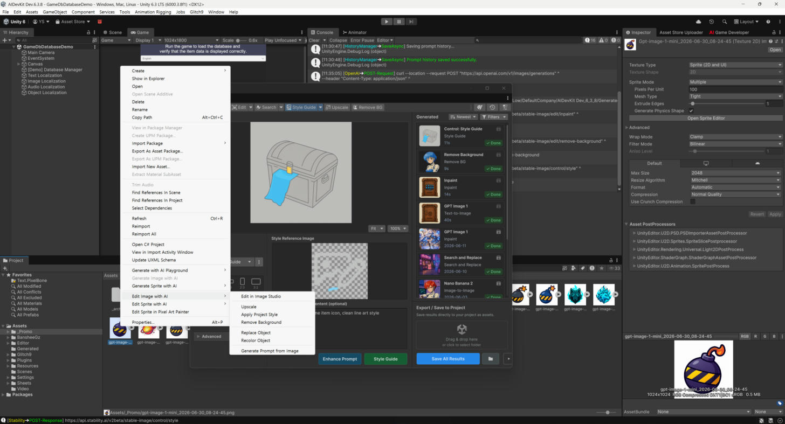

# Project Window Actions

Right-click in the Project window to generate and edit images without opening the studio.

<figure><figcaption></figcaption></figure>

## Generate

Right-click a **folder** (or empty Project space) → **`Generate Image with AI`**.

Opens AI Image Studio pre-targeted to the active project folder, ready for Text-to-Image /
Image-to-Image. Results save into that folder.

## Edit an image asset

Select exactly **one `Texture2D`** asset, right-click → **`Edit Image with AI`**:

| Menu item | What it does |
|---|---|
| **Edit in Image Studio** | Opens the full window with the texture preloaded |
| **Upscale** | One-click upscale pipeline |
| **Remove Background** | One-click background removal |
| **Apply Project Style** | Quick style transfer using the Project Art Profile |
| **Replace Object** | Maskless object replacement |
| **Recolor Object** | Maskless object recolor |
| **Generate Prompt from Image** | Produces a text prompt describing the selected image |

## One-click pipelines

**Upscale** and **Remove Background** run immediately as async pipelines with a progress window. On
completion you get a **before/after comparison dialog** with **Overwrite** and **Save As** — see
[Saving Results](../studio-window/saving.md).

> The edit actions appear only when a single `Texture2D` is selected. For multiple images or other
> asset types, open the window directly.
