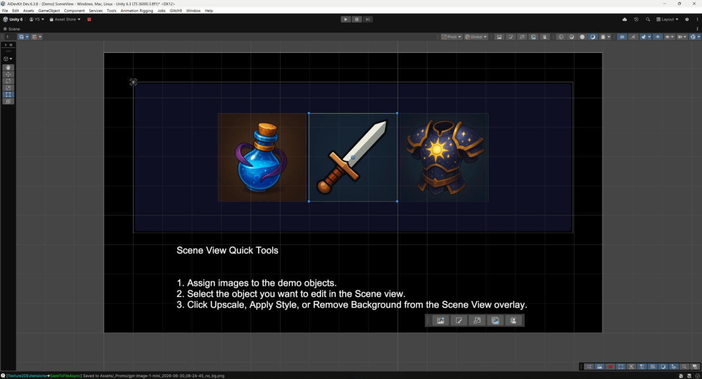

# Scene View Overlay

AI Image Studio adds an **AI Image Studio** overlay to the Unity Scene View so you can act on the
selected object's image without opening the window.

<figure><figcaption></figcaption></figure>

## Supported objects

Select a GameObject with one of:

* `SpriteRenderer`
* `UI.Image`
* `UI.RawImage`

The overlay buttons enable/disable automatically as your selection (and the object's image) changes.

## Buttons

| Button | What it does |
|---|---|
| **Generate** | Quick generation for the selected image field — works even on an empty sprite/texture slot |
| **Edit** | Opens AI Image Studio with the selected sprite/texture preloaded |
| **Upscale** | Runs the one-click upscale pipeline on the selected image |
| **Apply Style** | Applies the configured **Project Art Profile** style via quick style transfer |
| **Remove BG** | Runs the one-click background-removal pipeline |

## Show / hide buttons

Toggle which overlay buttons appear in **Preferences** (`Window > AI Image Studio > Preferences` →
Scene View). See [Settings](settings.md).

> **Apply Style** uses the project style defined in the **Project Art Profile** window
> (`Window > AI Image Studio > Project Art Profile`).
