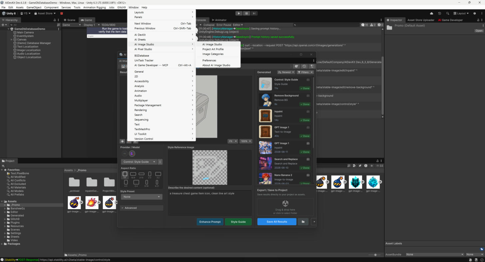

# Quick Start

A 5-minute tour: open the window, generate an image, edit it, and clean it up — then do the same
from code.

## 1. Open the window

`Window > AI Image Studio > AI Image Studio`

<figure><figcaption></figcaption></figure>

Make sure AI DevKit has a provider + API key configured first — see
[Providers & API Keys](../setup/providers.md).

## 2. Generate an image

1. Pick the **Text-to-Image** operation.
2. Enter a prompt (e.g. *"a rusty sci-fi door with bullet holes, game asset, transparent
   background"*).
3. Choose a model, then **Generate**.
4. **Save** — the result is written into the active project folder (or use **Save As**).

For a starting image, use **Image-to-Image** instead and drop in a source texture.

## 3. Edit the result

Switch operations to keep iterating on the same image:

* **Inpaint / Erase** — paint a mask and regenerate (or remove) just that area.
* **Recolor Object / Replace Object** — describe the object to target, then describe the change — no
  manual mask needed.
* **Outpaint** — drag the canvas handles to extend the image and fill the new space.

After saving, the result can become the **new source** for the next edit.

## 4. Clean it up

* **Remove Background** — one click to cut out the subject.
* **Upscale** — increase resolution with detail enhancement.

## 5. Do it from code

Every operation has a fluent extension method that follows the AI DevKit pattern:

```csharp
using Glitch9.AI;

// Upscale a texture
Texture2D bigger = await sourceTexture.GENUpscale().ExecuteAsync();

// Remove a background
Texture2D cutout = await sourceTexture.GENBackgroundRemoval().ExecuteAsync();

// Outpaint with an instruction
Texture2D wider = await sourceTexture
    .GENOutpaint("extend the alley to the left")
    .ExecuteAsync();
```

See the [Image Studio API](../scripting/README.md) for every method.

## Shortcuts from the Project window

You don't even need to open the window for common tasks — right-click a texture asset and use
**Edit Image with AI** (Upscale, Remove Background, …), or right-click a folder and use **Generate
Image with AI**. See [Project Window Actions](../editor-tools/project-window-actions.md).

## Next steps

* [Core Concepts](core-concepts.md) — operations, inputs, and the editor-vs-code split.
* [Image Studio Window](../studio-window/README.md) — every operation in detail.
