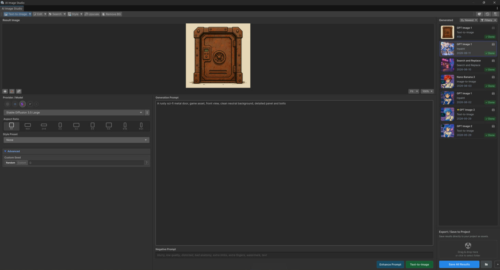

# Extra Providers (Stability & Replicate)

AI Image Studio adds **two provider integrations** on top of the base AI DevKit library:

* **Stability AI**
* **Replicate**

They register as provider families in the **same Unified API workflow**
(`SetModel(...).ExecuteAsync()`) — no separate SDK or code path. In the editor, pick one of their
models like any other; in code, `SetModel(...)` with the model you want.

<figure><figcaption></figcaption></figure>

## Provider-specific options

Some controls are only meaningful for certain providers, models, or operations, so they appear
**only when compatible** with your current selection:

| Option | Typical use |
|---|---|
| **Style Preset** | Bias generation toward a named visual style |
| **Inference Steps** | Trade speed for quality/detail (more steps = slower) |
| **Grow Mask** | Expand a painted mask outward before inpaint/erase |
| **Creativity** | How far a result may drift from the source (Image-to-Image and similar) |

If an option isn't shown, the selected model/operation doesn't support it.

## Which provider for which operation?

Not every provider implements every operation. The window only offers models that can run the
current operation, and disables **Generate** when the pairing is unsupported. Some advanced
operations (Outpaint, Recolor/Replace Object, Search-based edits, Replace Background & Relight) are
provider-specific — choose a compatible model when using them.

## API keys

Configure keys in **Preferences** (`Window > AI Image Studio > Preferences`). See
[Providers & API Keys](../setup/providers.md).
