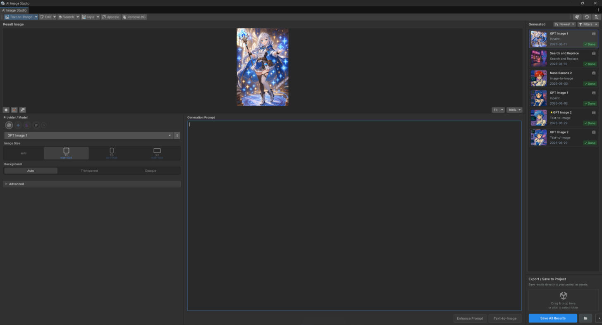

# Image Studio Window

Open it with `Window > AI Image Studio > AI Image Studio`.

The window is the hub for every operation — generate, edit, guide, and clean up images, then save
them into your project.

<figure><figcaption></figcaption></figure>

## Window layout

* **Operation tabs** — switch between Generation, Editing, Guided Generation, and Utilities.
* **Canvas / preview** — the source image and the generated result. Mask painting and outpaint
  handles appear here when the operation needs them.
* **Side panel** — prompt(s), model selection, provider options, and the **Generate** button.
* **Status** — live progress while a request runs, with a **Cancel** option.

## Operations

| Page | Operations |
|---|---|
| [Generation](generation.md) | Text-to-Image, Image-to-Image |
| [Editing](editing.md) | Inpaint, Outpaint, Recolor Object, Replace Object, Erase |
| [Guided Generation](guided-generation.md) | Sketch, Structure, Style Guide, Style Transfer |
| [Utilities](utilities.md) | Upscale, Remove Background, Replace Background & Relight |

## Working in the window

* **[Masking & Canvas](masking-and-canvas.md)** — paint masks for Inpaint/Erase and use the outpaint
  canvas handles.
* **[Saving Results](saving.md)** — save into the active folder, Save As, overwrite, and reuse a
  result as the next source.

## Validation

Each operation checks its inputs before running — for example, generation needs a prompt, editing
needs a source image, Inpaint/Erase need a painted mask, and Recolor/Replace Object need both a
target prompt and an edit prompt. The **Generate** button is disabled until requirements are met.
Full matrix: [Operations & Required Inputs](../reference/operations.md).

## Related windows

Also under `Window > AI Image Studio`:

* **Project Art Profile** — the project style used by *Apply Project Style* / Style Transfer.
* **Image Categories** — category registry used to organize generated images.
* **Preferences** — provider, model, and Image Studio settings (see [Settings](../editor-tools/settings.md)).
