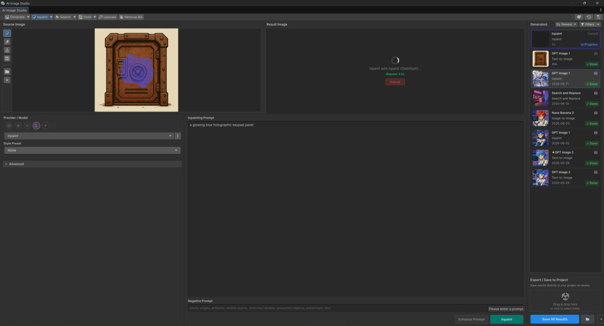

# Editing

Change an existing image — with or without a manual mask.

<figure><figcaption></figcaption></figure>

All editing operations **require a source image**. Load one from your project, or reuse the last
generated result.

## Inpaint

Regenerate a painted region from a prompt while leaving the rest of the image untouched.

* **Requires:** source image, a **painted mask**, and a prompt.
* See [Masking & Canvas](masking-and-canvas.md) for how to paint.

## Erase

Remove selected regions/objects and let the model fill the hole plausibly.

* **Requires:** source image and a **painted mask**.

## Recolor Object

Find an object by prompt and recolor / restyle it — **no manual mask**.

* **Requires:** source image, a **target prompt** (what to find) and an **edit prompt** (the new
  color/style).
* Example — target: *"the car"*, edit: *"matte black paint"*.

## Replace Object

Find an object by prompt and replace it with new content — **no manual mask**.

* **Requires:** source image, a **target prompt** (what to find) and an **edit prompt** (what to put
  there).
* Example — target: *"the wooden crate"*, edit: *"a metal ammo box"*.

## Outpaint

Expand the image beyond its original bounds and generate content for the new area.

* **Requires:** source image (a prompt is optional, to steer the extension).
* Use the **canvas expansion handles** to choose direction and amount — see
  [Masking & Canvas](masking-and-canvas.md).

## From code

```csharp
using Glitch9.AI;

// Erase (mask-based) — mask supplied on the request
Texture2D erased = await source.GENErase("remove the wires").ExecuteAsync();

// Recolor Object (maskless)
Texture2D recolored = await source.GENSearchAndRecolor("the car").ExecuteAsync();

// Replace Object (maskless)
Texture2D replaced = await source.GENSearchAndReplace("the wooden crate").ExecuteAsync();

// Outpaint
Texture2D wider = await source.GENOutpaint("extend the sky upward").ExecuteAsync();
```

Configure target/edit prompts and mask on the returned request object before `ExecuteAsync()` where
applicable. Full API: [Image Studio API](../scripting/README.md).
