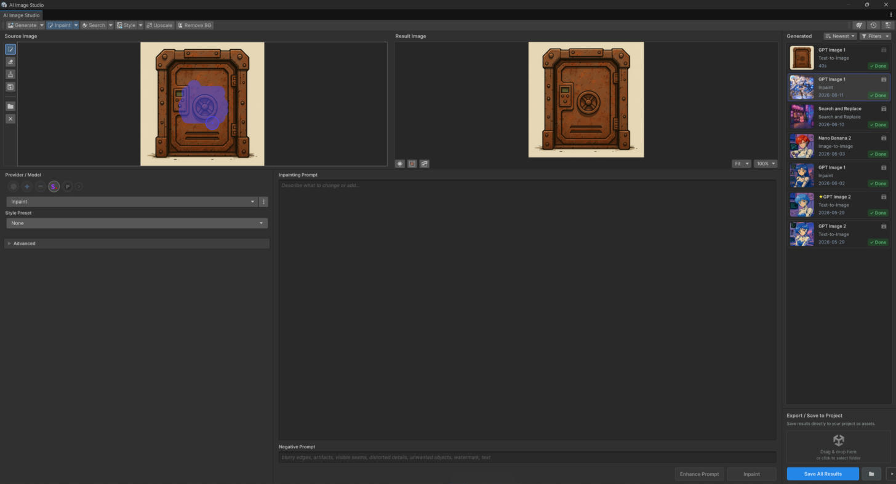
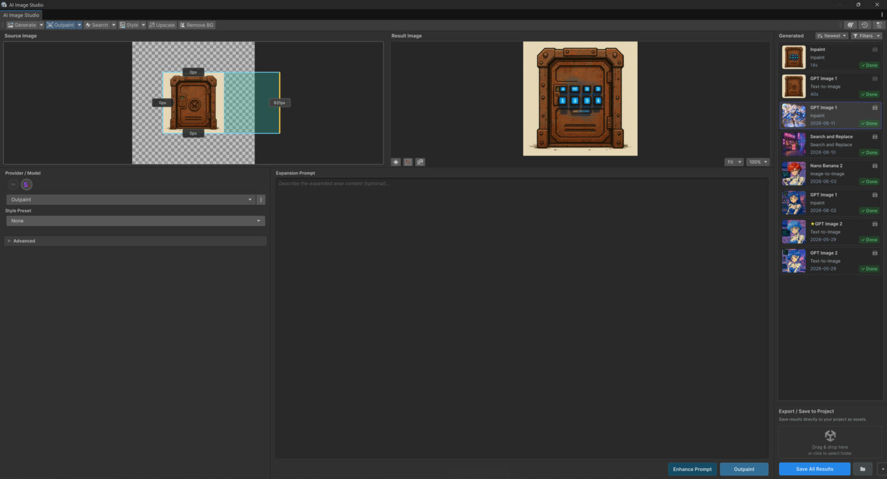

# Masking & Canvas

How to paint masks and expand the canvas inside the window.

## Painting a mask (Inpaint / Erase)

Mask-based operations act only on the region you paint.

* **Left-drag** — paint the mask.
* **Right-drag** — erase the mask.

<figure><figcaption></figcaption></figure>

Paint over the area you want to change (Inpaint) or remove (Erase), then **Generate**. Keep masks a
little larger than the target so edges blend; provider **Grow Mask** options (where supported) can
expand the mask automatically.

## Expanding the canvas (Outpaint)

Outpaint adds new space around the image and generates content to fill it.

* Drag the **canvas expansion handles** on the edges/corners to choose the direction and how far to
  extend.
* Optionally add a prompt to steer what appears in the new area.

<figure><figcaption></figcaption></figure>

## Live status

While a request runs, the window shows live progress and a **Cancel** button. Cancelling stops the
request without saving.

## Notes

* Masking is only shown for operations that use it. For maskless object editing (Recolor / Replace
  Object) you describe the target in a prompt instead — see [Editing](editing.md).
* Which controls appear depends on the selected model/provider. See
  [Extra Providers](../providers/README.md).
