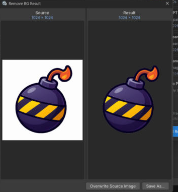

# Saving Results

AI Image Studio is tuned for production iteration — results are saved as real project assets.

## Generate operations

Text-to-Image, Image-to-Image, and guided generation save into:

* the **active project folder**, or
* a **default path** if no folder is active,

with an optional **Save As** to choose a location and name.

## Edit / utility operations

Inpaint, Outpaint, object edits, Upscale, Remove Background, and Replace Background & Relight can:

* **Overwrite the original** asset, or
* **Save As** a new file.

<figure><figcaption></figcaption></figure>

## Iterate on the result

After saving, the new image can become the **source texture** for the next operation — so you can
generate → inpaint → upscale → remove background without re-importing anything.

## Where quick actions save

One-click Project window actions (Upscale, Remove Background) run immediately and show a before/after
dialog with the same **Overwrite** / **Save As** choice. See
[Project Window Actions](../editor-tools/project-window-actions.md).

## Important

Generated and edited images are **real files** in your Unity project. They are **not** part of
Unity's Undo history — to discard an unwanted result, delete the asset manually.
