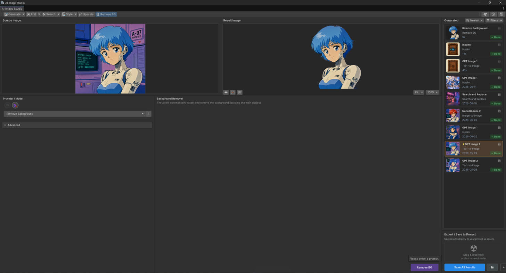

# Utilities

One-shot cleanup and enhancement operations. Each takes a **source image** and needs no prompt.

<figure><figcaption></figcaption></figure>

## Upscale

Increase image resolution with AI upscaling and detail enhancement — good for turning small
generations or legacy art into crisp, higher-resolution assets.

* **Input:** source image.

## Remove Background

Automatically segment the foreground and remove the background, producing a transparent cutout.

* **Input:** source image.
* Great for sprites, item icons, and UI graphics.

## Replace Background & Relight

Replace the image background and relight the subject so it sits naturally in the new scene.

* **Input:** source image (+ prompt describing the new background/lighting).

## From code

```csharp
using Glitch9.AI;

Texture2D bigger = await source.GENUpscale().ExecuteAsync();
Texture2D cutout = await source.GENBackgroundRemoval().ExecuteAsync();
```

Full API: [Image Studio API](../scripting/README.md).

## One-click from the Project window

Upscale and Remove Background are also available without opening the window — right-click a texture
asset and use **Edit Image with AI**. Completion shows a before/after dialog with **Overwrite** and
**Save As**. See [Project Window Actions](../editor-tools/project-window-actions.md).
